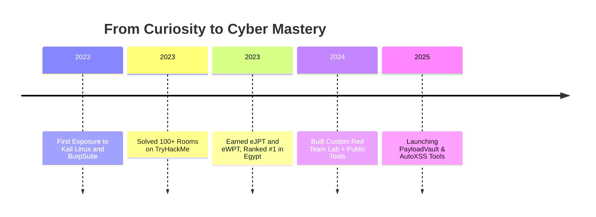

<h1 align="center"> Hey, I'm Youssef Mohamed</h1>

  
  
  

---

## 👨‍💻 About Me

I'm **Youssef Mohamed**, a highly driven cybersecurity enthusiast with a sharp focus on offensive security, red teaming, and vulnerability assessment. I'm a 4th-year CS student with a GPA of 3.6 and a mission to join a world-class red team. I ranked in the top 1% on TryHackMe and previously held the #1 spot in Egypt. I'm certified in eJPT, eWPT, Linux+, and CCNA. I've solved over 160 rooms on TryHackMe, tackled numerous PortSwigger labs, and developed a range of custom Python tools for XSS scanning, recon, and fuzzing. My hands-on experience covers OWASP Top 10 vulnerabilities, Active Directory exploitation, and advanced red team tactics.

---

## 🧠 More About Me

  <ul align="left">
    <li>💻 Passionate about Red Teaming and Threat Emulation</li>
    <li>🔬 Experience with web security, API fuzzing, and automation</li>
    <li>📚 Constant learner with deep interest in exploit development</li>
    <li>🐧 Linux lover with strong command-line kung-fu</li>
    <li>📈 Contributor to multiple open-source security tools</li>
    <li>🔗 Deep understanding of OWASP Top 10 and MITRE ATT&CK</li>
    <li>🎯 Mission-driven mindset: break to rebuild more secure systems</li>
  </ul>
  

---

## 🚀 Skill Arsenal

  
  
  
  
  
  
  
  
  
  
  
  
  
  
  
  
  
  
  

---

## 🧭 Journey

---

## 📂 Featured Repositories

- 🔍 [`xss-scanner`](https://github.com/youssef-mo55/xss-scanner): A Python tool to scan web pages for XSS vulnerabilities.
- 📚 [`book-scraper`](https://github.com/youssef-mo55/book-scraper): Extracts metadata from books to scrape.

---

  <b>"Hack like a beast. Think like a threat hunter. Document like a leader."</b>

