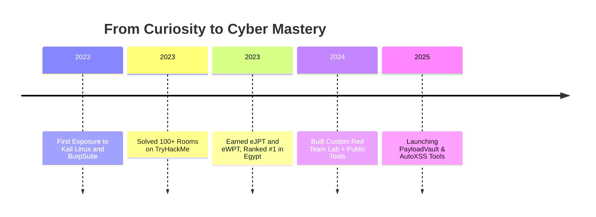

<h1 align="center">👋 Hey, I'm Youssef Mohamed</h1>

  
  
  

---

## 👨‍💻 About Me

I'm **Youssef Mohamed**, a highly driven cybersecurity enthusiast with a sharp focus on offensive security, red teaming, and vulnerability assessment.

- 🎓 3rd-year CS student | GPA: 3.6
- 🥇 **Top 1%** on TryHackMe | Former #1 in Egypt
- 📜 Certified: eJPT, eWPT, Linux+, CCNA
- 🧪 Solved 160+ rooms on TryHackMe and countless PortSwigger labs
- 🛠️ Developed custom Python tools for XSS, recon, and fuzzing
- 💣 Hands-on with OWASP Top 10, Active Directory exploitation, and red team tactics
- 💼 Goal: Join a world-class red team and build automation for modern exploit chains

---

## 🧠 More About Me

- 💻 Passionate about Red Teaming and Threat Emulation
- 🔬 Experience with web security, API fuzzing, and automation
- 📚 Constant learner with deep interest in exploit development
- 🐧 Linux lover with strong command-line kung-fu
- 📈 Contributor to multiple open-source security tools
- 🔗 Deep understanding of OWASP Top 10 and MITRE ATT&CK
- 🎯 Mission-driven mindset: break to rebuild more secure systems

---

## 🚀 Skill Arsenal

<table>
<tr>
  <td></td>
  <td></td>
  <td></td>
  <td></td>
</tr>
<tr>
  <td></td>
  <td></td>
  <td></td>
  <td></td>
</tr>
<tr>
  <td></td>
  <td></td>
  <td></td>
  <td></td>
</tr>
</table>

---

## 🧭 Journey

---

## 📂 Featured Repositories

- 🔍 [`xss-scanner`](https://github.com/youssef-mo55/xss-scanner): A Python tool to scan web pages for XSS vulnerabilities.
- 📚 [`book-scraper`](https://github.com/youssef-mo55/book-scraper): Extracts metadata from books to scrape.

---

  <b>"Hack like a beast. Think like a threat hunter. Document like a leader."</b>

